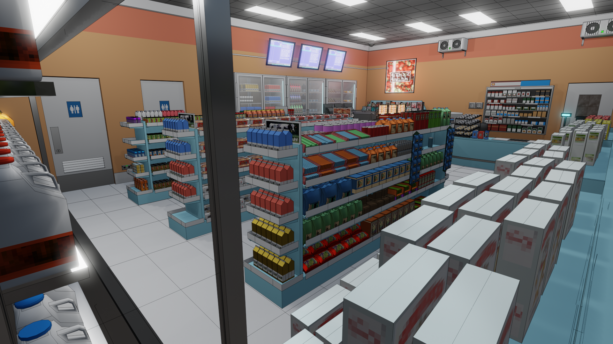
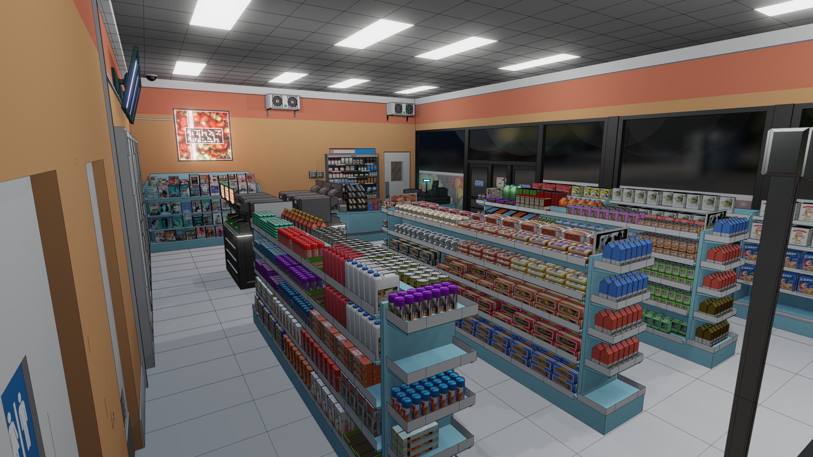
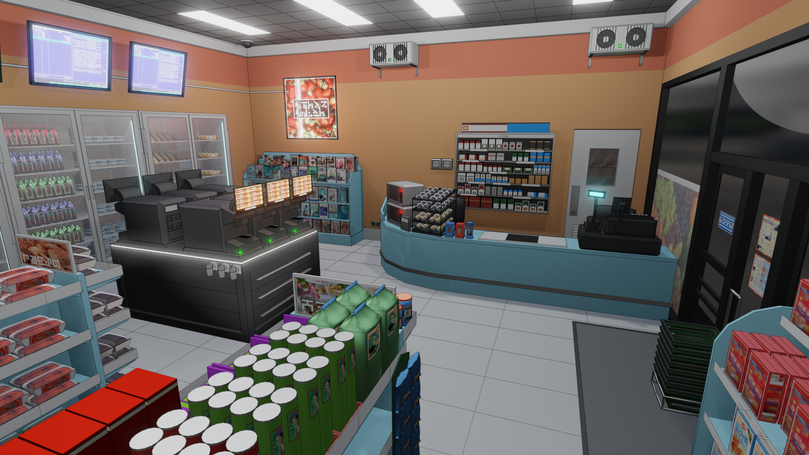
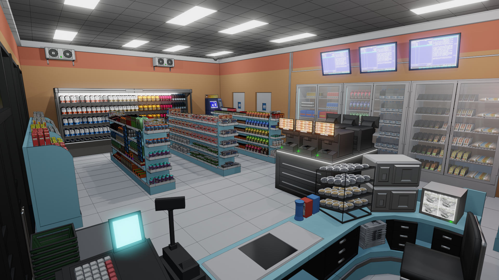
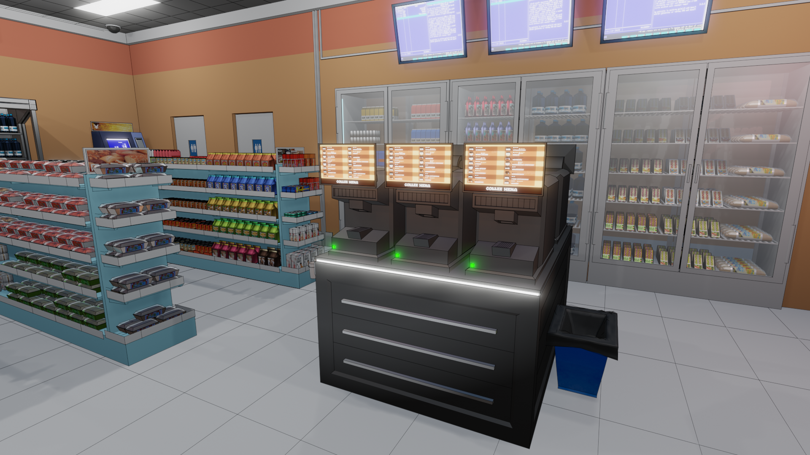
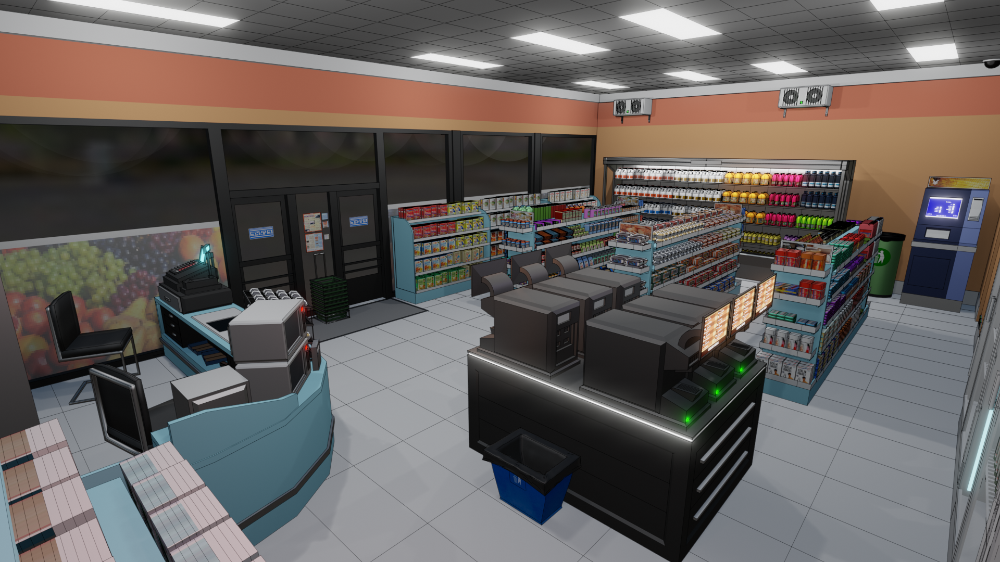
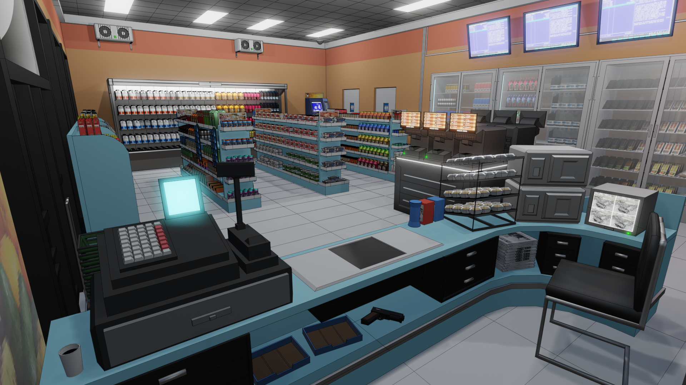
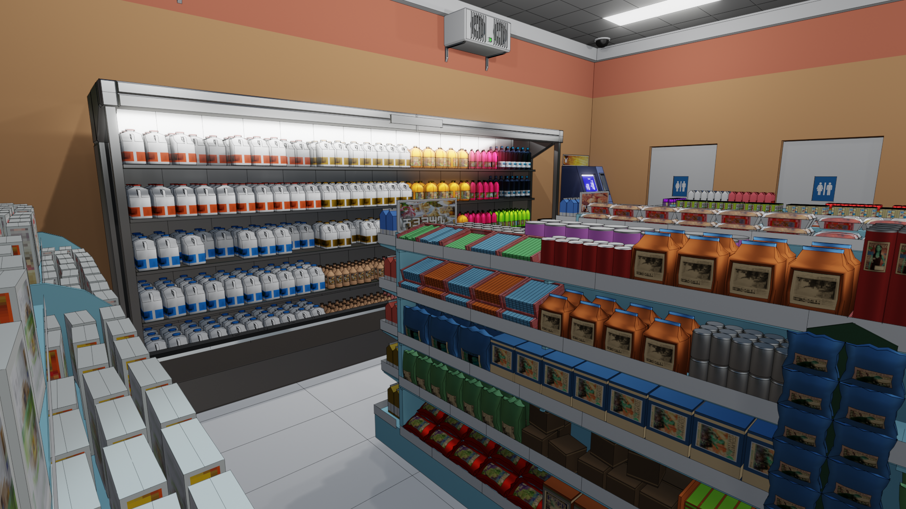

com.io7m.visual.convenience
==











License
===

```
© 2019 Mark Raynsford <visual@io7m.com>

This work is licensed under a Creative Commons Attribution 4.0
International License.

You should have received a copy of the license along with this
work. If not, see <http://creativecommons.org/licenses/by/4.0/>.

```

